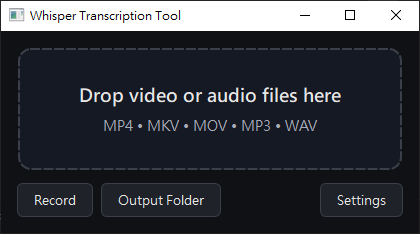
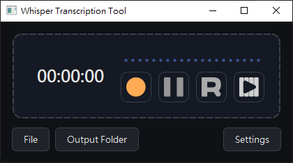
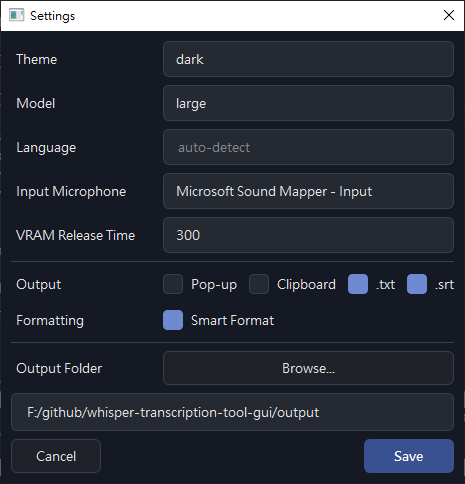

# Whisper Transcription Tool (GUI)




A desktop GUI for transcribing **audio/video files** and **microphone recordings** using [**OpenAI Whisper**](https://github.com/openai/whisper) (local inference).

Built with **PySide6** and designed to be simple:
- Drag & drop media files to transcribe
- Record from your microphone and transcribe in-memory
- Export results as `.txt` and/or `.srt`, copy to clipboard, or show a pop-up window
- Manage models and free VRAM automatically after idle (TTL)

## Features
- **Two modes**
  - **File mode**: drag & drop one or multiple files (queued and processed sequentially)
  - **Record mode**: record from your selected microphone and transcribe
- **Whisper model**: `tiny / base / small / medium / large / turbo`
- **Language hint (optional)**: set a language code (e.g., `en`, `zh`) to skip auto-detection
- **Output options (multi-select)**
  - Pop-up viewer (editable + copy)
  - Clipboard
  - Save `.txt`
  - Save `.srt`
- **Output folder shortcut**: open the output directory from the UI
- **Model lifecycle management**
  - Lazy load the model on demand
  - Automatically unload after an idle timeout to free GPU memory (VRAM)

## Supported Media Formats
- **Video**: `mp4`, `mkv`, `avi`, `mov`, `webm`
- **Audio**: `mp3`, `wav`, `m4a`, `flac`, `aac`, `ogg`

## Requirements
- **Python**: `>= 3.13`
- **FFmpeg**: installed and available in your `PATH`
- **(Optional) NVIDIA GPU**: for faster transcription via PyTorch CUDA on Windows/Linux

> This app uses FFmpeg to decode and resample media into a Whisper-friendly waveform.

## Installation (Recommended: uv)

This project is managed with **uv**:
- Fast dependency resolution
- Reproducible installs via `pyproject.toml`

### 1. Install uv
See the official instructions: https://astral.sh/uv/

### 2. Install dependencies
Clone this repository, then run in the repository root:

```bash
uv sync
```

## Usage
Windows: `whisper-transcription-tool-gui.bat`  
macOS/Linux: `bash whisper-transcription-tool-gui.sh`

```bash
uv run python gui.py
```
On first run, Whisper will download model weights (cached in `./cache/wishper/`).
